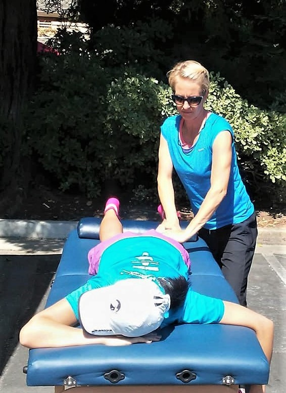

### Heini Tallent - Certified Massage Therapist
{:height="25%" width="25%" style="float:left; padding-right:15px;"}
Heini is a Sports &amp; Clinical Massage Therapist with 10 years’ experience working on sports maintenance, injury rehab and prevention, as well as chronic pain conditions – anything from tight shoulders and low back pain to migraines, hip issues and repetitive strain injuries. She has more than 1,000 hours of training under her belt, from deep tissue and sports massage to advanced techniques including trigger point therapy, soft tissue release, myofascial work, and sports stretching. She firmly believes in a holistic approach and getting to the source of the problem, not just focusing on and treating the symptoms.

Heini grew up in Finland and lived in England for 17 years – until moving to Danville with her family in 2016! She has played basketball, field hockey and tennis, and trained at the gym and in the pilates studio. She is a runner and a qualified running coach, bringing her knowledge of anatomy, physiology and biomechanics into her coaching, and her wealth of knowledge of training principles into her soft tissue work. She spends her free time exploring the Bay Area’s trails, cities and beaches with her husband, 7-year- old son and labradoodle puppy.

Check out her [site](http://zest-massage.com/)!
