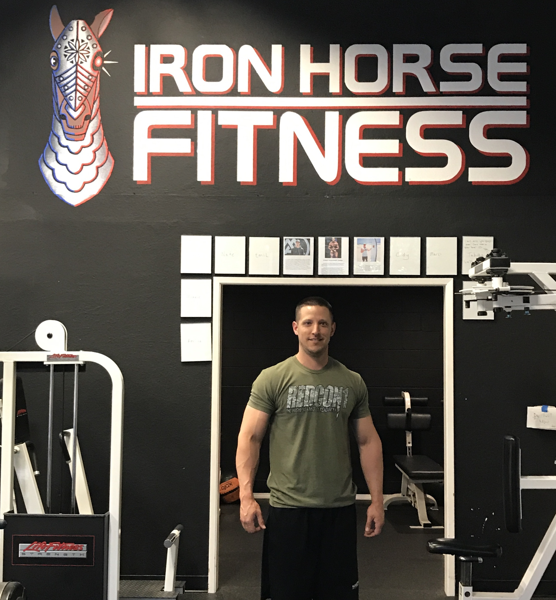
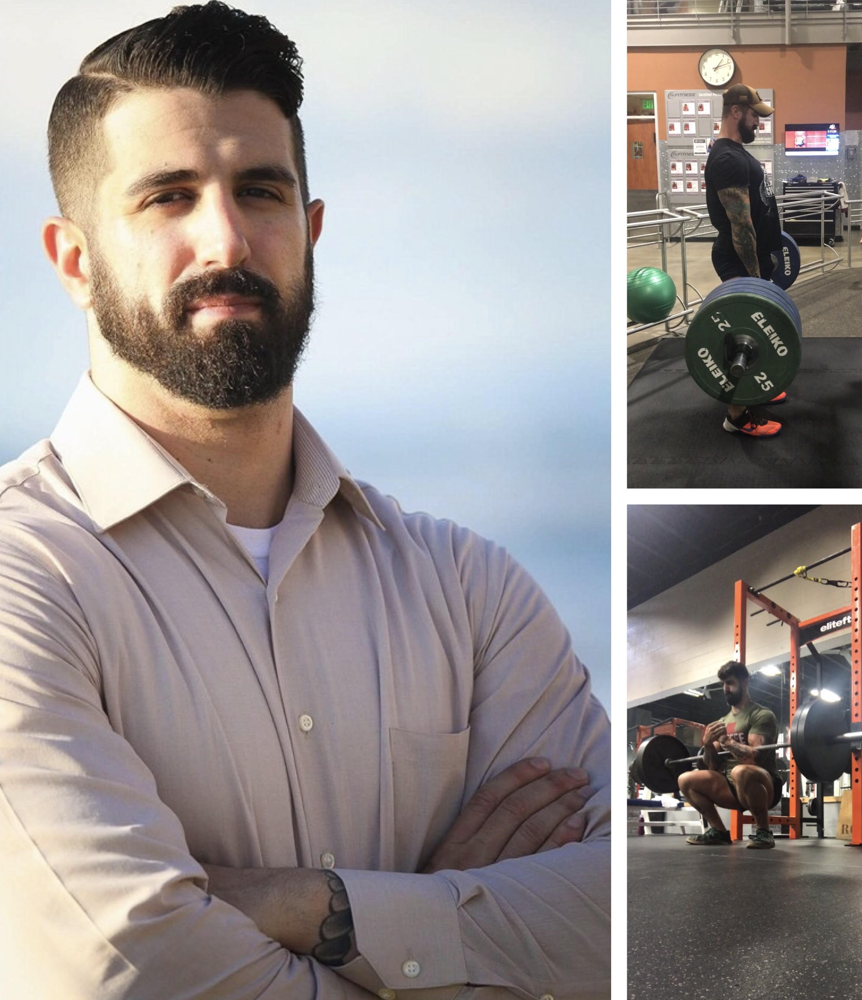
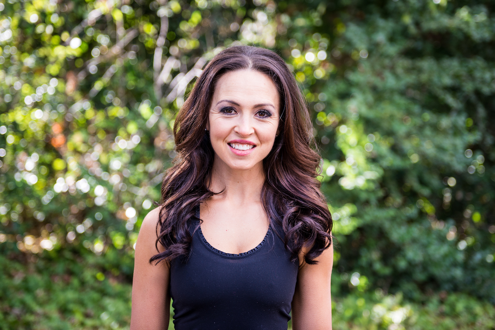
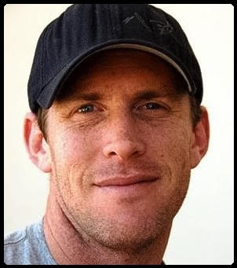

#### Eric

{:height="27.5%" width="27.5%" style="align: left; float:left; padding-top:10px; padding-right:15px;"}
Eric Walterhouse, owner of Iron Horse Fitness, is intensely focused on providing client-specific strength training, power lifting, injury rehab and sports performance as well as weight loss and general fitness. He works with people in all sports –baseball, football, hockey, golf and basketball.  Before becoming owner of Iron Horse Fitness, Eric was a Master Trainer at 24 Hour Fitness in San Ramon for 3 1/2 years, developing client-specific exercise programs, teaching lifting techniques, and helping with rehabilitation of injuries.   An NASM Certified Personal Trainer and member of the National Strength and Conditioning Association, Eric holds his Masters degree in Exercise Science and Rehab from Logan College of Chiropractic and his BS in Exercise Science from Missouri Baptist University (MBU), St. Louis, MO.  Eric played College-level baseball for four years and served as Assistant Coach for the NorCal Baseball Association in Danville, CA, from 2006 to 2010, coaching third base and supervising weight training and nutrition discussions.   At MBU, he was an Exercise Physiology Lab Assistant and a Teacher&#39;s Assistant/Lab Teacher for Exercise Testing and the Exercise Physiology Lab. He later became Ohlone Community College Baseball Strength and Conditioning Coach, developing the off-season strength program and supervising weekly training as well as teaching power-lifting techniques.
  

#### Marc

{:height="25%" width="25%" style="align: left; float:left; padding-top:10px; padding-right:15px;"}
Marc Lassalle is a Fitness Professional and Personal Trainer who has been working in the industry since 2012.  He served honorably in the United States Navy from 2008-2015, and deployed overseas in service to Operation Enduring Freedom, Operation New Dawn, and Joint Force Counter Piracy Operation Ocean Shield off the Horn of Africa.  His love of health, fitness, & working out started when he was deployed in 2011 as a stress reliever with day to day operations.  Once he returned home, Marc realized he wanted to turn this passion for fitness he discovered into a career to help people be their best selves and find their own stress relief.  In 2012, he became a Certified Personal Trainer and a Certified Sports Nutrition Specialist.  Marc started his fitness career with Crunch Gym in San Mateo, and from there he had partial ownership in a Nutrition Store in Redwood City, while training part time at a facility nearby and thus starting his Independent Training career.  Leaving Silicon Valley for good in 2015, he has been training clients full time ever since in the San Ramon/Danville Area.  Marc is a cut above the grain from his education & passion for his clients needs, to his quick witted sense of humor, and his trademark silkies shorts that make him his own. He has helped hundreds of people, and spent thousands of hours training clients to meet fitness goals, improve health, and quality of life.  Will you be the next person who he helps?  If you are looking to meet your fitness goals, stay motivated while having a good laugh, to adapt to a military like mindset of "never say die" & "there's only I can, not I can't", and become more educated with your workouts/knowledged about how your body works, Marc is the trainer for you.  
Marc's Education and Specialties 
Education: 
* NPTI Graduate Degree in APT Class of 15'
* National Academy of Sports Medicine, Certified Personal Trainer
* National Academy of Sports Medicine, Corrective Exercise Specialist 
* National Academy of Sports Medicine, Performance Exercise Specialist 
* National Academy of Sports Medicine, Weight Loss Specialist 
* National Academy of Sports Medicine, Fitness Nutrition Specialist 
* International Sport Sciences Association, Certified Personal Trainer
* International Sport Sciences Association, Sports Nutrition Specialist
  
Specialties: 
* Weight loss/Fat loss
* Lean Muscle Gain
* Corrective/Rehabilitation Exercise
* Mobility/Flexibility 
* Athletic Performance Exercise and Mechanics
* Adaptive Exercise for Special Needs/Handicapped Demographics 
* Powerlifting 
* Diet and Nutrition, IIFYM   
  

#### Marci

{:height="25%" width="25%" style="align: left; float:left; padding-top:10px; padding-right:15px;"}
Marci grew up in Danville, where she participated in many sports starting from a young age. Yet despite being active, she struggled with her weight until high school. It was then that she started paying more attention to her eating habits and joined a gym where she began lifting weights and taking group exercises in an effort improve her health and appearance. Her own transformation developed into a passion for nutrition and training and a desire to learn as much as she could about the subjects.  Marci attended the University of Oregon where she studied Magazine Editing and Public Relations. During this time she also obtained her personal training certification and and began working at a gym training clients. Upon graduating, she moved back to Danville and started working in outside sales. After only two years, she left the industry to follow what she knew was her true calling, a career helping others improve their lives through fitness, which she has been doing now for eight years. Marci emphasizes the importance of proper nutrition, daily movement, stress management, and sufficient sleep when trying to achieve a health or physique goal, and she works diligently with her clients to help them improve their habits in those areas. Her workouts are primarily focused on weight training, as she believes it is the best way to increase strength, improve body composition and gain confidence. She also helps her clients cultivate a positive and resilient mindset to foster lasting and sustainable change.  In addition to being a certified trainer, Marci is also a registered yoga instructor through Yoga Works.  When she’s not working with clients or performing her own workouts, Marci enjoys hiking, yoga, walking with friends and her dog, Wesley, writing, cooking, baking, entertaining, and rooting for the Ducks.
  

#### Cody

{:height="20%" width="20%" style="align: left; float:left; padding-top:10px; padding-right:15px;"}
My name is Cody Sinclair Burman, I am a Certified Personal Trainer through NESTA- National Exercise Sports Trainers Association. I was born and raised in Danville, CA and played Baseball and Football while attending Monte Vista High School.  I continues my sports career into college where I played baseball and rugby for Chico State University. This has led me into this career because I want to continue living a healthy lifestyle and provide a service for people to help make working out a part of their daily regimen!  I have had hands on experience and the opportunity of training and training with some of the top NFL, MLB athletes in the world as well as some of the top Olympic Weightlifters. I work with people of all ages and I will provide you with a service that will help meet your goals and motivate you to get the that next level. I provide all aspects from strength and conditions, core strength, endurance, power, speed, agility, functional movements, flexibility, coordination and most importantly injury prevention. Let me help you build that confidence , self-esteem and mental toughness and get you to that next level. Helping others is a passion of mine and I will personally help you one-on-one achieve your fitness and personal goals! "Dare to be Great"   " It's OK to be the BEST"   "BEASTMODE" Follow me on IG: [Bb_beastmodeBurman](https://www.instagram.com/Bb_beastmodeBurman/) Look Good, Feel Good, Get in Shape!
 

#### Jon

{:height="25%" width="25%" style="align: left; float:left; padding-top:10px; padding-right:15px;"}
Jon Lucchesi, a runner, triathlete and former member of the 2001 University of Oregon Pac-10 Championship Football Team, has an infectious enthusiasm for fitness. Working with some of the top minds in strength and conditioning on the University of Oregon Football field helped to shape his approach to fitness that he uses today. Jon specializes in run coaching, sports conditioning, mobility, and general fitness. He is a certified trainer with the National Academy of Sports Medicine, a certified level II run coach with USA Track and Field, and a certified TRX instructor.
  

#### Tom

{:height="20%" width="20%" style="align: left; float:left; padding-top:10px; padding-right:15px;"}
Tom Hodge has been coaching triathletes, cyclists and runners for 30 years.  Specializing in endurance athletes of all levels and abilities.  Tom enjoys coaching everyone from first timers to pros.  As a former pro triathlete himself, Tom understands the demands of endurance sports and has the experience and knowledge to help others achieve their athletic best.   With a B.S. in Kinesiology from the University of California, Los Angeles, and with 30 years of racing under his belt, Tom has completed over 300 multi-sport events including 23 Ironman’s.  He has participated in six Hawaiian Ironman World Championships and also a two-time Triathlon Team USA Member.  Tom has also worked for Stanford Athletics.  What sets him apart is not only his impressive finishing times but also his involvement and leadership in the triathlon and athletic community. For training session information contact Tom Hodge:[TOM@RECOVOX.NET](mailto:TOM@RECOVOX.NET)

#### Nate

{:height="20%" width="20%" style="align: left; float:left; padding-top:10px; padding-right:15px;"}
Nate Hollingsworth loves to help people be healthier, stronger and accomplish whatever fitness goals they might have. He was co-captain in high school varsity basketball, played Southern California junior college volleyball, loves cycling and races triathlon.  After nearly ten year careers in auto racing and finance Nate had an opportunity to pursue his passion of athletics by becoming a trainer at the Bay Club Financial District in 2010. After five years of providing personal training and teaching group exercise, at the end of 2014, he began building a clientele in the East Bay.  Nate is focused on teaching clients the skills they need to not only be fit but to enjoy the process and minimize overuse injury. He has certifications with NASM, Schwinn, TRX, P90X, and the Health Sciences Academy. He loves to teach strength and conditioning, basketball, running, and triathlon. He's ready to help you find your next level.

#### Jade

{:height="25%" width="25%" style="align: left; float:left; padding-top:10px; padding-right:15px;"}
For Jade, fitness runs in the family. She grew up around some of the biggest bodybuilding competitors in the
80’s, and her Aunt and Uncle are both heavyweight title holders. She attributes a lot of her knowledge to her
upbringing and early exposure to competitive training.She grew up in Almaden, where her no fear outgoing
nature lead her into competitive horse racing, jumping and barrel racing. She started training for bodybuilding
competitions in high school and began her professional dance career. Her life took an unexpected turn when
she developed a dangerous eating disorder. Fortunately, she found a way to use fitness to combat her disease
by taking radical step towards becoming healthy again. During this time, she became a successful national
NPC bodybuilder. She believes there are no excuses to not setting your health at the highest priority.  
Jade works as a NASM certified personal trainer, teaches fitness classes, assists youth leagues with
conditioning and nutrition, and started a business conditioning and training horses and dogs. Her philosophy is
that exercise should be something you have fun with, a form of meditation and a way to combat disease. With
her education in all areas of fitness, her training programs focus on building all areas of strength, balance,
flexibility, and cardio with proper simplified eating habits. To her the main purpose of staying healthy and fit
should be for a quality life, so building lean muscle and endurance through functional training in intense driven
workouts is her specialty.  
With her motivational bubbly personality, Jade continues to work timelessly to spread her broad fitness and
nutrition knowledge and love for healthy balanced living. She spends time weekly surfing, creating art, and at
the Raider games.  
