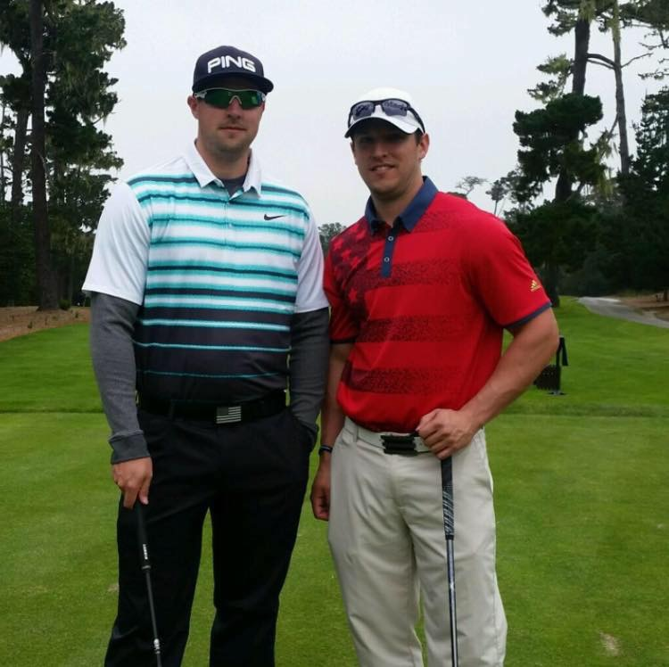

#### Eric

{:height="35%" width="35%" style="float:left; padding-right:15px;"}
Eric Walterhouse, owner of Iron Horse Fitness, is intensely focused on providing client-specific strength training, power lifting, injury rehab and sports performance as well as weight loss and general fitness. He works with people in all sports –baseball, football, hockey, golf and basketball.  Before becoming owner of Iron Horse Fitness, Eric was a Master Trainer at 24 Hour Fitness in San Ramon for 3 1/2 years, developing client-specific exercise programs, teaching lifting techniques, and helping with rehabilitation of injuries.   An NASM Certified Personal Trainer and member of the National Strength and Conditioning Association, Eric holds his Masters degree in Exercise Science and Rehab from Logan College of Chiropractic and his BS in Exercise Science from Missouri Baptist University (MBU), St. Louis, MO.  Eric played College-level baseball for four years and served as Assistant Coach for the NorCal Baseball Association in Danville, CA, from 2006 to 2010, coaching third base and supervising weight training and nutrition discussions.   At MBU, he was an Exercise Physiology Lab Assistant and a Teacher&#39;s Assistant/Lab Teacher for Exercise Testing and the Exercise Physiology Lab. He later became Ohlone Community College Baseball Strength and Conditioning Coach, developing the off-season strength program and supervising weekly training as well as teaching power-lifting techniques.

#### Marci

{:height="35%" width="35%" style="float:left; padding-right:15px;"}
Marci grew up in Danville, where she participated in many sports starting from a young age. Yet despite being active, she struggled with her weight until high school. It was then that she started paying more attention to her eating habits and joined a gym where she began lifting weights and taking group exercises in an effort improve her health and appearance. Her own transformation developed into a passion for nutrition and training and a desire to learn as much as she could about the subjects.  Marci attended the University of Oregon where she studied Magazine Editing and Public Relations. During this time she also obtained her personal training certification and and began working at a gym training clients. Upon graduating, she moved back to Danville and started working in outside sales. After only two years, she left the industry to follow what she knew was her true calling, a career helping others improve their lives through fitness, which she has been doing now for eight years. Marci emphasizes the importance of proper nutrition, daily movement, stress management, and sufficient sleep when trying to achieve a health or physique goal, and she works diligently with her clients to help them improve their habits in those areas. Her workouts are primarily focused on weight training, as she believes it is the best way to increase strength, improve body composition and gain confidence. She also helps her clients cultivate a positive and resilient mindset to foster lasting and sustainable change.  In addition to being a certified trainer, Marci is also a registered yoga instructor through Yoga Works.  When she’s not working with clients or performing her own workouts, Marci enjoys hiking, yoga, walking with friends and her dog, Wesley, writing, cooking, baking, entertaining, and rooting for the Ducks.

#### Codi

{:height="35%" width="35%" style="float:left; padding-right:15px;"}
My name is Cody Sinclair Burman, I am a Certified Personal Trainer through NESTA- National Exercise Sports Trainers Association. I was born and raised in Danielle, CA and played Baseball and Football while attending Monte Vista High School.  I continues my sports career into college where I played baseball and rugby for Chico State University. This has led me into this career because I want to continue living a healthy lifestyle and provide a service for people to help make working out a part of their daily regimen! I have had hands on experience and the opportunity of training and training with some of the top NFL, MLB athletes in the world as well as some of the top Olympic Weightlifters. I work with people of all ages and I will provide you with a service that will help meet your goals and motivate you to get the that next level. I provide all aspects from strength and conditions, core strength, endurance, power, speed, agility, functional movements, flexibility, coordination and most importantly injury prevention. Let me help you build that confidence , self-esteem and mental toughness and get you to that next level. Helping others is a passion of mine and I will personally help you one-on-one achieve your fitness and personal goals! "Dare to be Great"   " It's OK to be the BEST"   "BEASTMODE" Follow me on IG: [Bb_beastmodeBurman](https://www.instagram.com/Bb_beastmodeBurman/) Look Good, Feel Good, Get in Shape!

#### Jon

{:height="35%" width="35%" style="float:left; padding-right:15px;"}
Jon Lucchesi, a runner, triathlete and former member of the 2001 University of Oregon Pac-10 Championship Football Team, has an infectious enthusiasm for fitness. Working with some of the top minds in strength and conditioning on the University of Oregon Football field helped to shape his approach to fitness that he uses today. Jon specializes in run coaching, sports conditioning, mobility, and general fitness. He is a certified trainer with the National Academy of Sports Medicine, a certified level II run coach with USA Track and Field, and a certified TRX instructor.
